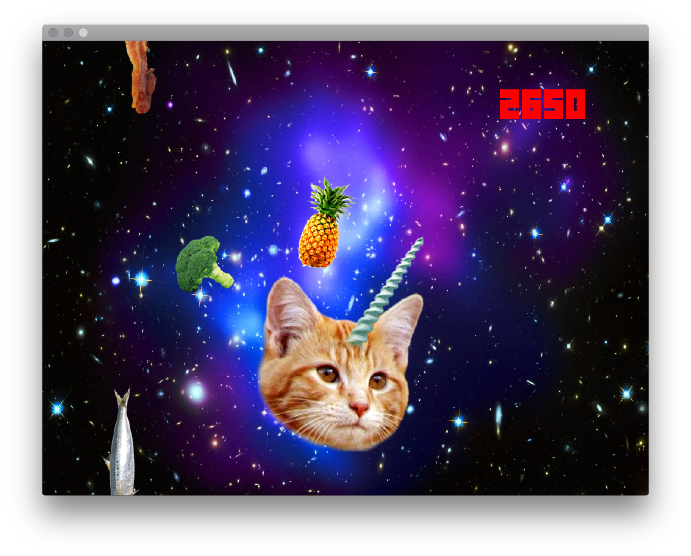

# cat-o-licious

This is a simple cat game written in Go and SDL, inspired by [flappy](https://github.com/campoy/flappy/). My kids were too excited to see flappy's source code and wanted to design and code their own game, so that's what we did together in a rainy Sunday.



### Install

If you're not here for the code, and just want to play, you can download binary releases from https://github.com/fiorix/cat-o-licious/releases/.

### Keys

Arrows left and right, as well as A and D for lateral movement.
F for full screen, and Q to quit.

### Playing

You're the cat, and food falls from the top of the screen. The more good stuff you lick the more points you make. The more points you make the more food drops, and it gets really hard to get out of the way of the broccoli, tomatos and pineapples.

My kids love veggies btw, but they say that cats don't.

### Building from source

Tested on MacOS, Linux, and Windows. Requires cgo.

Install go-sdl2 bindings:

```
go get -v -d github.com/veandco/go-sdl2/{sdl,img,mix,ttf}
```

More information on [go-sdl2](https://github.com/veandco/go-sdl2#installation). go-sdl2 ships with static SDL2 in `.go-sdl2-libs/` so you don't have to install SDL for your OS.

Get the code, build static binary:

```
go get -v -d github.com/fiorix/cat-o-licious
cd $GOPATH/src/github.com/fiorix/cat-o-licious
go build -v -tags static
```

The assets directory must be relative to the path of the binary. Assets include fonts, images, and sounds used by the game. The font was copied from flappy, images randomly downloaded from the Internet, and the game soundtrack is my daughter's composition in Garage Band. Go figure.

Run:

```
./cat-o-licious
```

There's a minimal set of command line flags for things like screen resolution, player speed, and FPS.